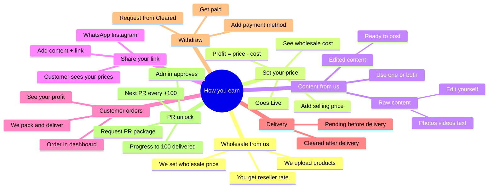

# Reseller Mindmap Prompt (Simple)

Paste this into ChatGPT, Claude, Napkin, Miro, Whimsical, or any mindmap tool.

**Goal:** Explain to resellers — in an easy way — how *their* work works.  
Also make clear: **we set wholesale prices**, **we provide media/content**, and **PR unlock after 100 successful orders**.

---

## Prompt (copy from here)

```
Create a simple, clear mindmap for Mocha Wear RESSELLERS.

Audience: Resellers who are new.
Purpose: Explain what the reseller does, how they get wholesale rates, content, earn money, and unlock PR packages.
Language: Easy English. Short labels. No jargon.
Style: Clean mindmap. Easy to present in 2–3 minutes.

==================================================
ROOT
==================================================
How you earn with Mocha Wear

==================================================
MAIN BRANCHES
==================================================

1) We give you wholesale rates
   - We upload products
   - We set the wholesale price for resellers
   - You get the product at wholesale rate (not full retail)
   - This is your cost

2) Set your selling price
   - Open “Set prices” in your dashboard
   - You see wholesale cost
   - You set your own selling price (within allowed range)
   - Your profit = your price − wholesale
   - Product becomes Live

3) We give you content / media
   - We provide product content for sharing
   - Option A: Raw content (photos / videos / text you can edit yourself)
   - Option B: Edited content (ready-to-post creatives)
   - Use whichever you prefer — or both
   - Post with your link

4) Share your link
   - Copy your referral link
   - Or share a product link
   - Send on WhatsApp / Instagram / social with the content
   - Anyone who opens it sees YOUR prices

5) Customer orders
   - Customer buys through your link
   - Order shows in your Orders page
   - You can see your profit on that order
   - We handle packing and delivery

6) Delivery = your money
   - Before delivery → profit is Pending
   - After successful delivery → profit becomes Cleared
   - Cleared = money you can withdraw

7) Withdraw
   - Add your payment method (JazzCash / Easypaisa / Bank etc.)
   - Request withdraw from Cleared balance
   - Get paid to your account

8) Unlock PR after 100 orders
   - Progress bar shows successful (delivered) orders
   - Goal: 100 delivered orders
   - At 100, you can request a PR package from us
   - Request goes to admin for approval
   - Every next 100 orders unlocks another PR request
   - Shown on Dashboard and Orders page

==================================================
ONE SIMPLE FLOW LINE
==================================================
Wholesale from us → Set your price → Use our content → Share link → Customer buys → We deliver → Cleared → Withdraw
(+ after 100 delivered orders → Request PR)

==================================================
5 KEY POINTS TO HIGHLIGHT (big / bold)
==================================================
1. We give wholesale prices
2. You set your selling price + profit
3. We give raw + edited content
4. Share link → delivery → withdraw
5. 100 successful orders → request PR package  

==================================================
OUTPUT RULES
==================================================
- Keep it simple and visual
- Short words on every node
- Make wholesale + content + PR branches very clear (these are what WE provide)
- No admin jargon, no APIs, no technical settings
- Markdown nested list OR mermaid mindmap is fine
```

---

## One-liner (say this while showing the map)

> We give you wholesale rates + content → you set your price → share with our media → customer buys → we deliver → you withdraw. After 100 successful orders, you can request a PR package.

---

## Mermaid (optional)




---

## 60-second script (for explaining live)

1. Hum products upload karte hain aur **wholesale price** lagate hain — yeh tumhara cost rate hai.
2. Tum dashboard mein **Set prices** pe jao aur apni selling price set karo — farq = tumhara profit.
3. Hum **content / media** bhi dete hain — **raw** (khud edit karo) aur **edited** (ready-to-post). Dono use kar sakte ho.
4. Content ke sath apni **link** WhatsApp / Instagram pe bhejo.
5. Customer order karega — Orders mein dikhega; packing/delivery hum karenge.
6. Delivery ke baad profit **Cleared** → us se **Withdraw** kar lo.
7. **100 successful (delivered) orders** ke baad tum **PR package** demand kar sakte ho — progress bar dashboard aur Orders pe dikhegi; request admin ko jayegi.

